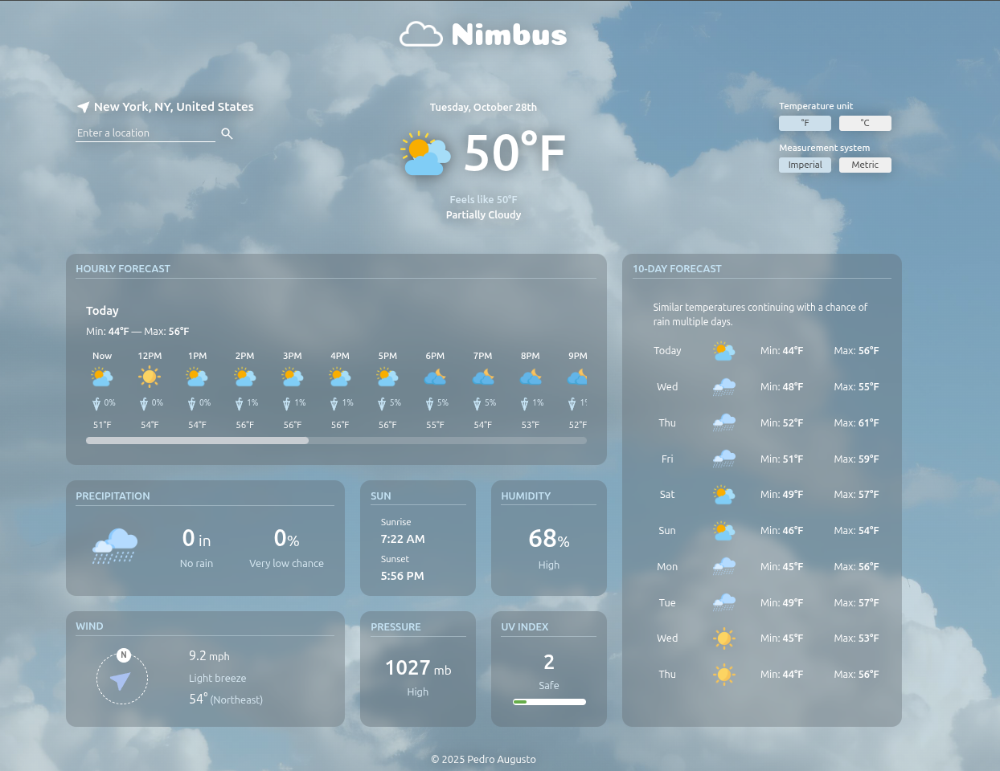
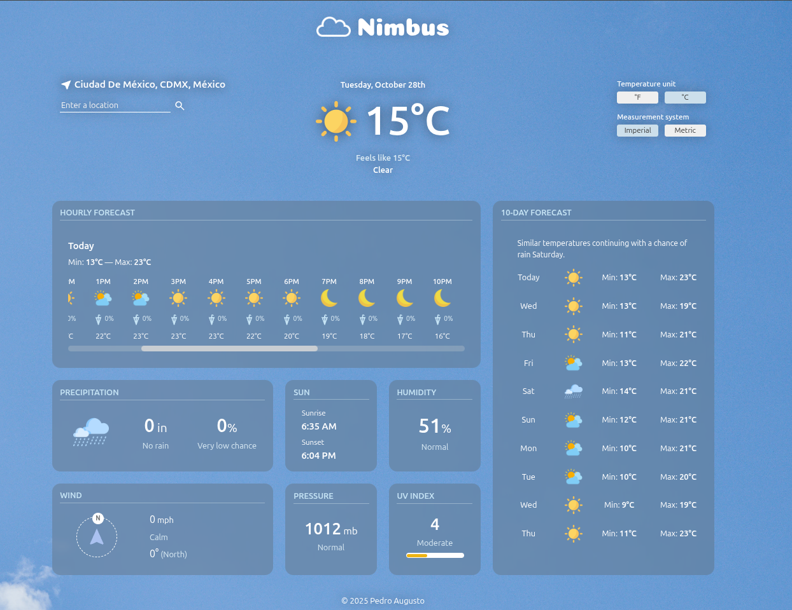
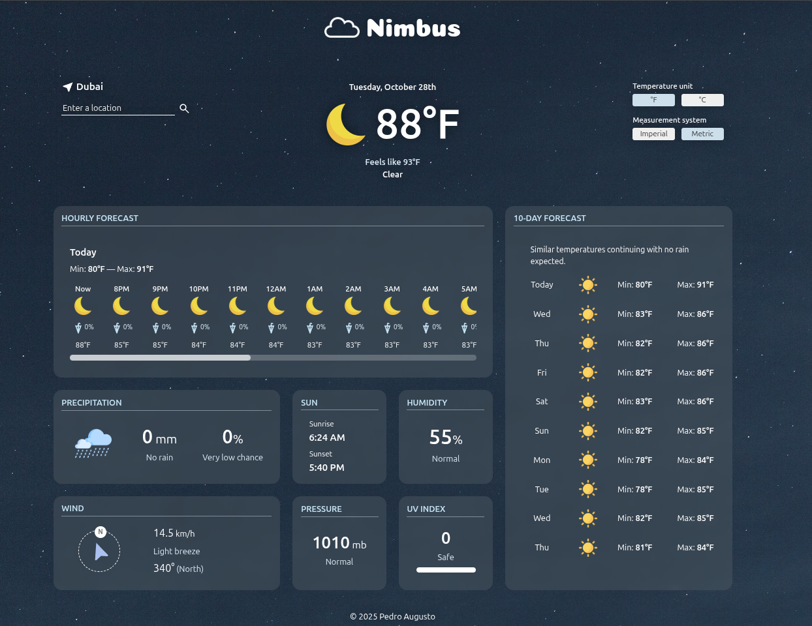
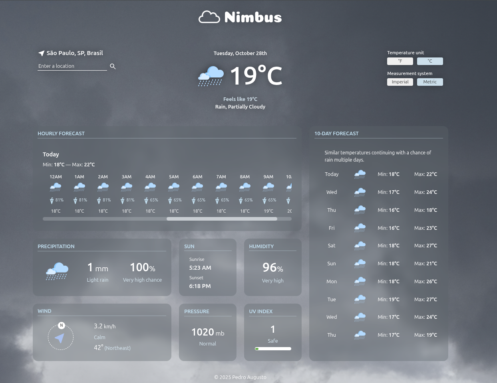

# Weather App

## Description

- Nimbus — a weather forecast website that fetches weather data from the [Visual Crossing](https://www.visualcrossing.com/) API. Users can search for any location to view its weather information. The application includes informative cards such as hourly forecast, 10-day forecast, precipitation, wind, humidity, and more. It also allows toggling between Fahrenheit and Celsius, as well as imperial and metric units.
- **Main features:**
  - Weather API module (create requests and fetch data from Visual Crossing)
  - Weather data module (process the weather raw data)
  - DOM manager module (create/edit/delete DOM elements)
  - Asynchronous functions
  - Webpack module bundler

## Live Demo

**[Click here](https://pedroasb.github.io/weather-app/)** to try out this project on browser.

## Screenshots

## About the Project

This project is part of the curriculum of [The Odin Project](https://www.theodinproject.com/). You can check out other projects that I've built in my [fullstack-journey](https://github.com/PedroASB/fullstack-journey) repository.

## Attributions

- **Fonts**
  - Coiny — available on [Google Fonts](https://fonts.google.com/) under the Open Font License
- **Images**
  - Partly Cloudy Day: Photo by Ronaldo R&K: https://www.pexels.com/photo/clouds-on-the-sky-16638535/
  - Partly Cloud Night: <a href="https://www.freepik.com/free-photo/abstract-background-featuring-sky-clouds_15666017.htm#fromView=search&page=1&position=48&uuid=ba0457e9-f4bd-4d0d-bf9b-73a5e56f54da&query=night+sky+cloud">Image by [rawpixel.com](http://rawpixel.com/) on Freepik</a>
  - Clear Night: <a href="https://www.freepik.com/free-photo/stars-night-textured-backdrop_12191015.htm#fromView=search&page=1&position=29&uuid=2901cbe7-fa34-44bb-879d-8e71b1b60128&query=night+sky">Image by [rawpixel.com](http://rawpixel.com/) on Freepik</a>
  - Clear Day: <a href="https://www.freepik.com/free-photo/beatiful-blue-sky-with-clouds-sunny-day_47769989.htm#fromView=search&page=1&position=26&uuid=6222ae4c-d7fc-4321-88c9-c10143ed6d79&query=day+sky">Image by [krakenimages.com](http://krakenimages.com/) on Freepik</a>
  - Cloudy: Photo by [Artem Anokhin](https://unsplash.com/@atronyx?utm_source=unsplash&utm_medium=referral&utm_content=creditCopyText) on [Unsplash](https://unsplash.com/photos/photo-of-white-clouds-V4qjYCac7y8?utm_source=unsplash&utm_medium=referral&utm_content=creditCopyText)
  - Wind: <a href="https://www.freepik.com/free-photo/cloudy-sky-background_7899052.htm#fromView=search&page=1&position=2&uuid=eadb4d2e-d5a0-4174-80e2-d7cb10beef47&query=wind+sky">Image by eberhardgross on Freepik</a>
  - Rain: <a href="https://www.freepik.com/free-photo/storm-clouds_1172984.htm#fromView=search&page=1&position=21&uuid=b5e31d15-5d7f-46af-84b0-be24f70d4328&query=rain+sky">Image by freestockcenter on Freepik</a>
  - Snow: <a href="https://www.freepik.com/free-photo/background-with-lights-snowflakes_986396.htm#fromView=search&page=1&position=3&uuid=f2416015-9148-4d57-a541-4977b78e6a7c&query=snowy+sky">Background with Lights Snowflakes on Freepik</a>
  - Fog: <a href="https://www.freepik.com/free-photo/closeup-large-gray-clouds_1436340.htm#fromView=search&page=1&position=5&uuid=4bea0665-e7ba-4157-b4d2-a52b1d06a338&query=fog+sky">Image by kotkoa on Freepik</a>
- **Icons**
  - Logo: <a href="https://www.flaticon.com/free-icons/cloud" title="cloud icons">Cloud icons created by Freepik - Flaticon</a>
  - Snow: <a href="https://www.flaticon.com/free-icons/snow" title="snow icons">Snow icons created by Freepik - Flaticon</a>
  - Rain: <a href="https://www.flaticon.com/free-icons/rain" title="rain icons">Rain icons created by apien - Flaticon</a>
  - Fog: <a href="https://www.flaticon.com/free-icons/fog" title="fog icons">Fog icons created by Yudhi Restu - Flaticon</a>
  - Wind: <a href="https://www.flaticon.com/free-icons/wind" title="wind icons">Wind icons created by Freepik - Flaticon</a>
  - Cloudy: <a href="https://www.flaticon.com/free-icons/cloudy" title="cloudy icons">Cloudy icons created by bqlqn - Flaticon</a>
  - Partially cloudy day: <a href="https://www.flaticon.com/free-icons/cloudy" title="cloudy icons">Cloudy icons created by kosonicon - Flaticon</a>
  - Partially cloudy night: <a href="https://www.flaticon.com/free-icons/cloudy-night" title="cloudy night icons">Cloudy night icons created by Konkapp - Flaticon</a>
  - Clear day: <a href="https://www.flaticon.com/free-icons/sun" title="sun icons">Sun icons created by DinosoftLabs - Flaticon</a>
  - Clear night: <a href="https://www.flaticon.com/free-icons/moon" title="moon icons">Moon icons created by Freepik - Flaticon</a>
  - Umbrella icon by [Google](https://fonts.google.com/icons) – Licensed under Apache 2.0
